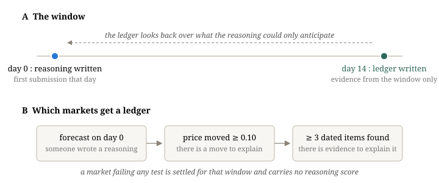
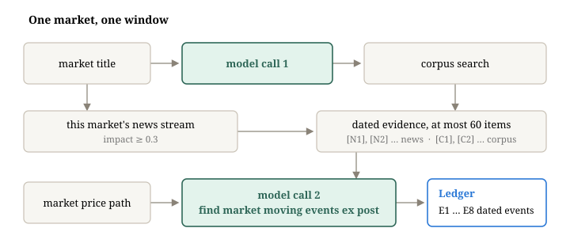
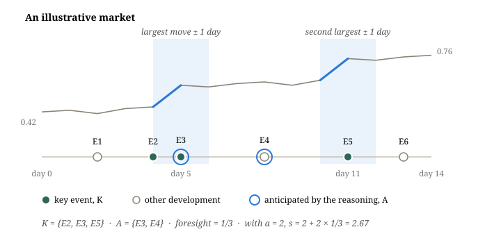

# Grading Reasoning in Hindsight

A forecast comes with a number and a reasoning. The number can be scored against the market; the reasoning is harder. This document describes the mechanism grading it: for every reforecast market whose price moved, we wait two weeks, write down **what actually happened**, and then ask whether the reasoning a miner wrote at the start saw it coming.

We call the written record a **hindsight ledger**. It is built once per market and window, from evidence dated inside the window only, and every miner's reasoning on that market is graded against the same ledger.

## 1. Two moments in time

The reasoning is written on day 0, with whatever the miner's agent could retrieve. The ledger is written on day 14, looking back. Only markets that give the ledger something to explain get one.

*The reasoning and the ledger sit at opposite ends of a 14-day window (A). A ledger is only attempted when the market was forecast, moved, and left a trail (B).*

## 2. Writing the ledger

The builder makes two model calls per market, with fixed retrieval between them. The first call turns the market title into search queries. Retrieval then draws on two sources: the news stream already matched to this market, and a date-bounded search of our corpus. The second call reads the dated evidence next to the market price path and writes the ledger.

*Two model calls, fixed retrieval between them. The second call reads the dated evidence beside the market price path and writes the ledger.*

A ledger needs at least three developments besides the market's own move; a thinner one is discarded and the market carries no reasoning score for that window.

## 3. Grading a reasoning against it

A grader model reads the miner's text beside the ledger and returns two things that matter. The first is an **argument** grade $a \in \{0,1,2\}$: whether the text connects its facts to its final number, where a list of headlines earns 0. The second is the set $A$ of later ledger events whose substance the text anticipated.

Let $K$ be the key events: those dated after day 0 that fall within one day of the two largest daily price moves, or every later event if none does. The score is

$$
s = \begin{cases} 0 & a = 0 \\ a + 2\cdot\dfrac{|A \cap K|}{|K|} & a \ge 1 \end{cases} \qquad s \in [0, 4]
$$

*Anticipating E4 earns nothing here: it happened, but it is not among the events that moved the price. Anticipating E3 earns a third of the foresight term.*

Two cases never reach the grader. A reasoning under 50 characters scores 0. A miner whose agent produced no reasoning at all is imputed the 25th percentile of the scores on that ledger.

> **What this rewards.** A text that names concrete drivers, says how each moves the probability, and turns out to have named the ones that mattered.
